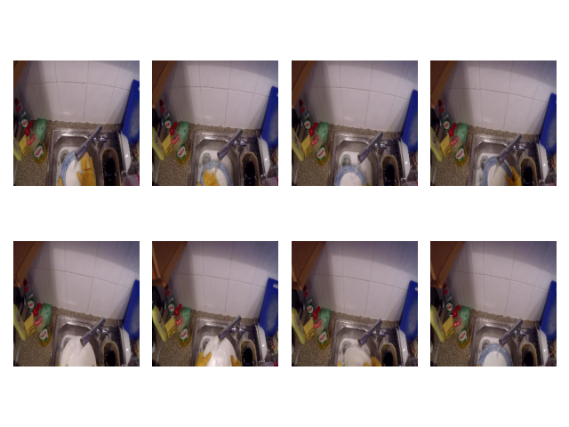
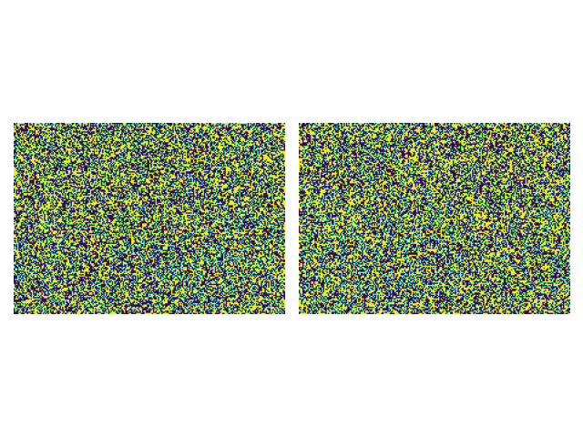
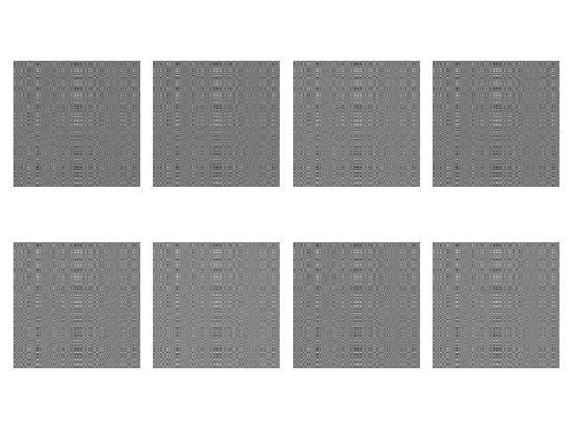
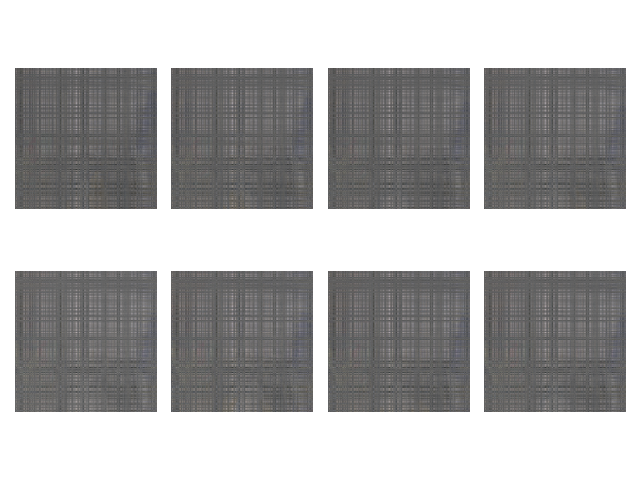

# Compressed Learning for Egocentric Action Recognition

Improving the portability and tractability of egocentric action recognition on EPIC-KITCHENS by learning with compressed measurements.

## Installation

Clone egocentric-compressed-learning

```
git clone https://github.com/sjpollard/egocentric-compressed-learning.git
```

Prepare anaconda environment, `mamba` also works

```
conda env create -n ecl -f environment.yml
```

## Dataset

Download and extract frames from [EPIC-KITCHENS](https://github.com/epic-kitchens/epic-kitchens-download-scripts)

```
python epic_downloader.py --rgb-frames --epic55-only
```

If you want to preprocess EPIC-KITCHENS frames into chunked pytorch files

```
python data.py --label example --dataset-path path/to/EPIC-KITCHENS --num-annotations n --chunks c
```

To print the random performance on these dataset splits

```
python data.py --label example --random-perf
```

## Run

Then train the neural network with defaults

```
python main.py tsn --label example --chunks c
```

If you want to postprocess EPIC-KITCHENS frames from the dataset

```
python main.py tsn --load postprocessed --dataset-path path/to/EPIC-KITCHENS --num-annotations n
```

To utilise compressed learning, input measurement matrix heights and corresponding modes

```
python main.py tsn --label example --chunks c --matrix-type t --measurements m1 m2 m3 m4 --modes 0 1 2 3
```

To learn the measurement and inference matrices as weights of the neural network

```
python main.py tsn --label example --chunks c ... --learn-phi --learn-theta
```

To save model as a checkpoint after training

```
python main.py tsn --label example --chunks c ... --model-label example-model
```

To visualise annotation and compressed sensing with checkpointed matrix

```
python visualise.py --label example --model-label example-model --chunks c --modes 0 1 2 3
```

## How does it work?

Take an example clip from EPIC-KITCHENS



Here we have measurement matrices for spatial compression



Apply these matrices to compress the clip



Reshape the compressed clip with matrix transpose for neural network input



## Arguments

### main.py

- `model_type` (str): Only supports `'tsn'`
- `--segment_count` (int): Number of temporal segments to sample from
- `--load` (str): Use `'preprocessed'` or `'postprocessed'` dataset
- `--dataset-path` (str): Path to the EPIC-KITCHENS folder on the device
- `--label` (str): Label prepended to preprocessed dataset files
- `--matrix-type` (str): `'bernoulli'` or `'gaussian'` matrices
- `--measurements` (int tuple): Heights of measurement matrices
- `--modes` (int tuple): Modes corresponding to measurement matrices
- `--learn-phi` (on/off): Adds the measurement matrices as a learnable parameter
- `--learn-theta` (on/off): Adds the inference matrices as a learnable parameter
- `--num-annotations` (int): Number of annotations to postprocess from EPIC-KITCHENS
- `--chunks` (int): Number of evenly sized chunks in preprocessed dataset
- `--ratio` (int tuple): Ratio of train/val/test splits respectively in postprocessed dataset
- `--seed` (int): Random seed used to generate train/val/test splits
- `--epochs` (int): Number of training epochs
- `--batch_size` (int): Number of clips per batch
- `--lr` (float): Learning rate of the network
- `--val_frequency` (int): Epochs until validation set is tested
- `--log_frequency` (int): Steps until logs are saved with `wandb`
- `--print_frequency` (int): Steps until training batch results are printed
- `--model-label` (str): Label of given checkpoint
- `--save-model` (on/off): Saves model for inference
- `--load-model` (on/off): Loads model for inference
- `--index` (int): Clip to do model inference with

### data.py

- `--segment_count` (int): Number of temporal segments to sample from
- `--dataset-path` (str): Path to the EPIC-KITCHENS folder on the device
- `--label` (str): Label to prepend to preprocessed dataset files
- `--num-annotations` (int): Number of annotations to preprocess from EPIC-KITCHENS
- `--chunks` (int): Number of evenly sized chunks to preprocess into
- `--ratio` (int tuple): Ratio of train/val/test splits respectively in preprocessed dataset
- `--seed` (int): Random seed used to generate train/val/test splits
- `--random-perf` (on/off): Print random performance of dataset splits

### visualise.py

- `--label` (str): Label prepended to preprocessed dataset files
- `--model-label` (str): Label of saved model checkpoint
- `--modes` (int tuple): Modes corresponding to measurement matrices
- `--chunks` (int): Number of evenly sized chunks in preprocessed dataset
- `--split` (str): `'train'`, `'val'` or `'test'` dataset split to visualise from
- `--index` (str): Index of clip to visualise

## Acknowledgements
This project borrows ideas and/or code from the following preceding works:

```
@inproceedings{TSN2016ECCV,
  author    = {Limin Wang and
               Yuanjun Xiong and
               Zhe Wang and
               Yu Qiao and
               Dahua Lin and
               Xiaoou Tang and
               Luc {Val Gool}},
  title     = {Temporal Segment Networks: Towards Good Practices for Deep Action Recognition},
  booktitle   = {ECCV},
  year      = {2016},
}
```
```
@article{price2019_EvaluationActionRecognition,
    title={An Evaluation of Action Recognition Models on EPIC-Kitchens},
    author={Price, Will and Damen, Dima},
    journal={arXiv preprint arXiv:1908.00867},
    archivePrefix={arXiv},
    eprint={1908.00867},
    year={2019},
    month="Aug"
}
```
```
@inproceedings{damen2018_ScalingEgocentricVision,
   title={Scaling Egocentric Vision: The EPIC-KITCHENS Dataset},
   author={Damen, Dima and Doughty, Hazel and Farinella, Giovanni Maria  and Fidler, Sanja and
           Furnari, Antonino and Kazakos, Evangelos and Moltisanti, Davide and Munro, Jonathan
           and Perrett, Toby and Price, Will and Wray, Michael},
   booktitle={European Conference on Computer Vision (ECCV)},
   year={2018}
}
```
```
@article{tran2020multilinear,
  title={Multilinear compressive learning},
  author={Tran, Dat Thanh and Yama{\c{c}}, Mehmet and Degerli, Aysen and Gabbouj, Moncef and Iosifidis, Alexandros},
  journal={IEEE transactions on neural networks and learning systems},
  volume={32},
  number={4},
  pages={1512--1524},
  year={2020},
  publisher={IEEE}
}
```
